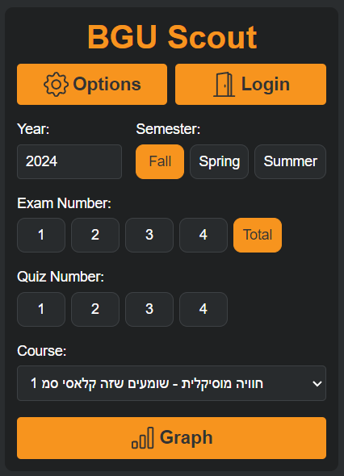
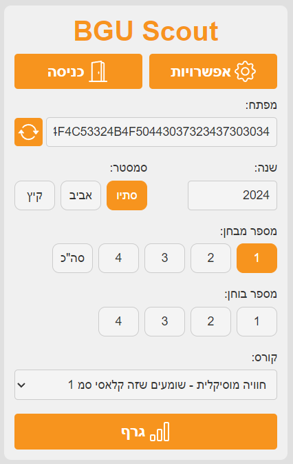
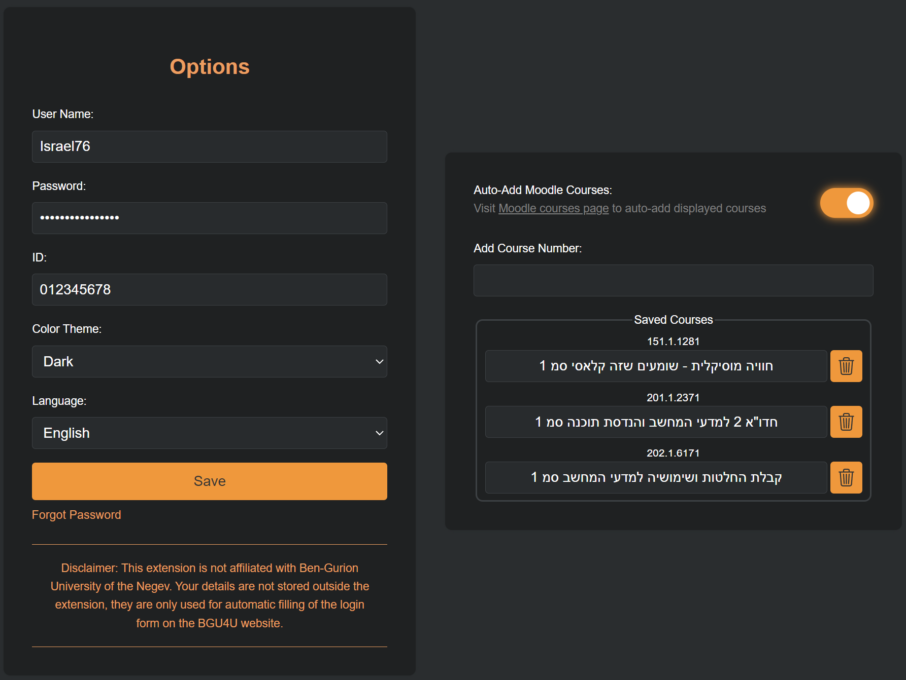
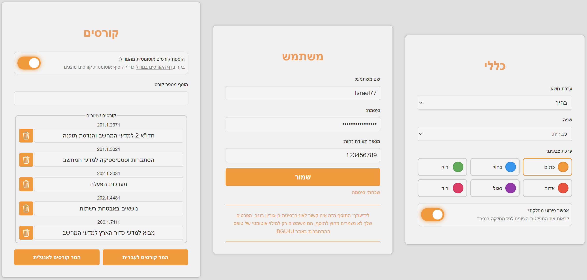

# 
 BGU Scout Extension

  
  <a href="https://github.com/RL199/BGU-Scout/issues">
    

  <em>A Chrome extension that helps BGU students easily access and visualize course statistics and grades.</em>

---

## 📚 Table of Contents

- [ BGU Scout Extension](#-bgu-scout-extension)
  - [📚 Table of Contents](#-table-of-contents)
  - [📖 Project Overview](#-project-overview)
  - [🎯 Features](#-features)
  - [⚙️ Installation](#️-installation)
    - [Prerequisites](#prerequisites)
    - [Steps](#steps)
  - [🔧 Configuration](#-configuration)
  - [📊 Usage](#-usage)
    - [Generating Course Statistics](#generating-course-statistics)
  - [📸 Screenshots](#-screenshots)
    - [Popup Page](#popup-page)
    - [Options Page](#options-page)
  - [🛠️ Technical Details](#️-technical-details)
    - [Technologies Used](#technologies-used)
    - [Features Implementation](#features-implementation)
  - [🗺️ Roadmap](#️-roadmap)
  - [🔐 Privacy and Security](#-privacy-and-security)
    - [Permissions](#permissions)
  - [👥 Contributing](#-contributing)
  - [📝 License](#-license)
  - [🔍 Browser Support](#-browser-support)
  - [❓ FAQs](#-faqs)
    - [How do I install the extension?](#how-do-i-install-the-extension)
    - [Can I use this extension on other browsers?](#can-i-use-this-extension-on-other-browsers)
  - [📞 Contact](#-contact)

## 📖 Project Overview

BGU Scout is a Chrome extension designed to assist Ben-Gurion University students in accessing and visualizing course statistics and grades. The extension offers various features such as graphical representation of course data, theme switching, bilingual support, and quick access to university portals.

## 🎯 Features

- **Course Statistics Visualization**: Generate graphical representations of course statistics and grades.
- **Dark/Light Mode Support**: Automatic theme switching based on system preferences or manual selection.
- **Bilingual Support**: Full Hebrew and English language support.
- **Course Management**: Save and manage multiple course numbers for quick access.
- **Quick Access**: Direct links to BGU's login portal and grade system.
- **User Data Management**: Securely store and manage user credentials.

## ⚙️ Installation

### Prerequisites

- Google Chrome or a Chromium-based browser, such as Edge or Opera.

### Steps

1. Download or clone this repository.
2. Open Chrome and navigate to `chrome://extensions/`.
3. Enable "Developer mode" in the top right corner.
4. Click "Load unpacked" and select the extension directory.
5. The extension icon should now appear in your Chrome toolbar.

## 🔧 Configuration

1. Click the extension icon to open the popup interface.
2. Click "Options" to configure:
   - Username, Password and ID number (BGU credentials)
   - Theme preference (Light/Dark/System)
   - Language preference (English/Hebrew/System)
   - Moodle Auto-Add Courses (On/Off)
   - Course numbers and names
3. Save your settings.
4. Use the popup interface to generate grade statistics and access BGU systems.

## 📊 Usage

### Generating Course Statistics

1. Open the extension popup.
2. click the double arrow icon to generate new key.
3. Enter the desired year.
4. Choose the desired semester and Exam/Quiz number.
5. Select the course name from the dropdown list.
6. Click the "Graph" icon.
7. Enjoy the graphical representation of the course statistics.

## 📸 Screenshots

### Popup Page
Effortlessly manage your BGU course statistics and grades with a user-friendly interface.

### Options Page
Configure your extension settings and customize your experience with ease.

## 🛠️ Technical Details

### Technologies Used

- HTML5
- CSS3 with CSS Variables for theming
- Vanilla JavaScript
- Chrome Extension APIs
  - Storage API
  - Tabs API
  - Scripting API

### Features Implementation

- **Theme System**: Uses CSS variables for consistent theming across all components.
- **Localization**: Built-in translation system for Hebrew and English.
- **Form Validation**: Client-side validation for course numbers and user input.
- **Storage Management**: Efficient use of Chrome's storage sync API.

## 🗺️ Roadmap

- [ ] Add support for searching courses by name.
- [ ] Improve user experience and accessibility.
- [ ] Add more customization options.
- [ ] Improve error handling and user feedback.
- [ ] Add support for more BGU systems and services.
- [ ] Add support for more browsers and platforms.
- [ ] Improve security and privacy features.
- [ ] Add support for more data formats and standards.
- [ ] Improve performance and scalability.
- [ ] Add support for more devices and screen sizes.
- [ ] Improve documentation and code quality.

## 🔐 Privacy and Security

- **User Data**: User credentials are stored locally in Chrome's secure storage and are only used for BGU login authentication. No Private data is transmitted to external servers except for BGU's official sites during key extraction.
- **Data Handling**: Course statistics are fetched directly from BGU's servers and are not stored locally.
- **Permissions**: The extension only requests the necessary permissions for its functionality.

### Permissions

The extension requires the following permissions:

- `storage`: For saving user preferences and course numbers.
- `tabs`: For opening BGU websites.
- `activeTab`: For interacting with the current tab.
- `scripting`: For injecting scripts into BGU websites.
- Host permissions for BGU domains:
  - `https://bgu4u22.bgu.ac.il/*`
  - `https://reports4u22.bgu.ac.il/*`
  - `https://bgu4u.bgu.ac.il/*`

## 👥 Contributing

Feel free to open issues and submit pull requests. Please ensure your code follows the existing style and includes appropriate documentation.

## 📝 License

This project is licensed under the MIT License - see the LICENSE file for details.

## 🔍 Browser Support

- Chrome: Latest version
- Chromium-based browsers (Edge, Opera, etc.): Latest versions

## ❓ FAQs

### How do I install the extension?

Follow the [Installation](#installation) section above.

### Can I use this extension on other browsers?

The extension is primarily designed for Chrome and Chromium-based browsers.

## 📞 Contact

For any inquiries, please contact [roy3@post.bgu.ac.il](mailto:roy3@post.bgu.ac.il).

---

  Made with ❤️ for BGU Students

